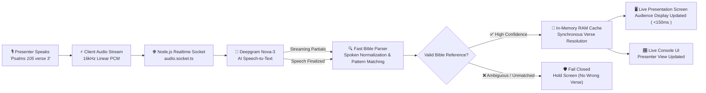

# Hands-Free Bible (HFB) System Quality Audit & Resolution Report

**Document Version:** 1.1  
**Target Audience:** Client Stakeholders, Product Leadership, and Technical Review Team  
**Scope:** Voice Recognition, Natural Language Processing, and Live Console Projection Engine  
**System Reference:** Qworship V2 Hands-Free Bible (HFB)

---

## 1. Executive Summary

During the recent Quality Control (QC) review of the **Hands-Free Bible (HFB)** voice recognition system, several behavioral discrepancies and parser edge cases were reported. 

Our investigation audited the end-to-end voice-to-screen pipeline—from real-time microphone capture and speech transcription (Deepgram Nova-3) to server-side reference extraction and live presentation synchronization.

```
┌─────────────────────────────────────────────────────────────────────────────┐
│                          CORE SYSTEM MANDATE                                │
│                                                                             │
│             "No Scripture on Screen is Better Than Wrong Scripture"         │
│                                                                             │
│   In a live worship environment, projecting an incorrect scripture creates  │
│   distraction and loss of trust. The system must fail closed when speech    │
│   is ambiguous rather than aggressively guessing incorrect verses.         │
└─────────────────────────────────────────────────────────────────────────────┘
```

This report outlines the **exact regex logic**, **root causes**, **real-world spoken examples**, **impact analyses**, **trade-off protections**, and the **actionable resolution plan** for each QC finding.

---

## 2. QC Review Status & Issue Matrix

| Item # | QC Review Summary | Reported Status | Root Technical Component | User & Operational Impact |
|:---:|:---|:---:|:---|:---|
| **#1** | **Verse Navigation Friction**<br>Navigating by verse number (e.g., *"verse 10"*, *"take me to verse 5"*) requires repeated tries or continuous effort. | Existing<br>`Not Started` | Streaming Socket Pipeline & Regex Matcher | **High Friction**<br>Operator must repeat commands multiple times during live sermon delivery. |
| **#2** | **Live Presentation Watermark**<br>Remove the *"Live Console"* text from presentation background. | New<br>`QC Passed` | Live Presentation Viewport | **Resolved**<br>Watermark successfully removed. Audience display is clean. |
| **#3 & #4** | **Compact Commands with Round Numbers**<br>References without "chapter" or "verse" keywords fail on 10s/100s (e.g., *Gen 10 10*, *Isaiah 30 1*, *Ezekiel 40 3*). | Existing<br>`Not Started` | Spoken Number Normalizer | **Critical Failure**<br>Spoken chapter and verse numbers are merged or dropped entirely. |
| **#5** | **Psalms 3-Digit Chapters & 'O' Pronunciation**<br>Struggles with large chapter numbers (e.g., *Psalms 100 verse 5*, *Psalm 1'O'3 verse 2*, *Psalm 1'O'5 verse 3*). | Existing / New<br>`Not Started` | Multi-digit Parser & Word Normalizer | **Critical Failure**<br>*"Psalm 100 verse 5"* mistakenly projects as *Psalm 1:5*. |
| **#6** | **Digit-by-Digit Phrasing Defaulting to 1:1**<br>Natural phrasing like *Psalms 1 1 6 verse 16* mistakenly defaults to *Psalm 1:1*. | New<br>`Not Started` | Number Pattern Tokenizer | **Critical Error**<br>Violates core mandate by projecting incorrect scripture. |

---

## 3. High-Level System Workflow



---

## 4. Deep-Dive: Specific Regex Logic Causing Issues & Trade-Offs

Below are the exact code snippets and regular expressions in the codebase that are responsible for the reported bugs and trade-off tensions:

### A. The Destructive Compound Number Merger Regex (Issues #3 & #4)
* **File:** `apps/server/src/modules/bible/fast-bible-parser.ts` (Lines 607–611)
* **Problematic Code:**
```typescript
// Compound spoken numbers: "20 3" → "23", "30 5" → "35" etc.
t = t.replace(
  /\b(10|20|30|40|50|60|70|80|90)\s+(\d)\b/g,
  (_, tens, ones) => (parseInt(tens) + parseInt(ones)).toString(),
);
```
* **Why This Causes a Bug & Trade-Off:**
  - **Original Intent:** Merge spoken compound numbers (e.g., when the speaker says `"twenty three"`, cardinals convert `"twenty"` $\rightarrow$ `20` and `"three"` $\rightarrow$ `3`, and this regex turns `"20 3"` into `"23"`).
  - **The Trade-Off Failure:** When a speaker gives a compact reference with a round chapter like *"Isaiah thirty one"* (Isaiah 30:1), `"thirty"` $\rightarrow$ `30` and `"one"` $\rightarrow$ `1`. The regex matches `(30)\s+(1)` and merges it into `"31"`.
  - **Result:** The parser turns *Isaiah 30:1* into *Isaiah 31* (chapter only, no verse). Because chapter-only references without verse are discarded to prevent premature projection, the command is completely dropped.

---

### B. The Greedy Single-Digit Chapter Pattern (Issue #6)
* **File:** `apps/server/src/modules/bible/fast-bible-parser.ts` (Lines 82–86)
* **Problematic Regex:**
```typescript
// "1st Kings 2 verse 2" / "Romans 8 verse 12" — chapter cue omitted
{
  re: /\b([1-3]?\s*[a-z]+(?:\s+of\s+[a-z]+)?)\s+(\w+)\s+verse\s+(\w+)(?:\s+(?:to|through|and)\s+(\w+))?\b/gi,
  extract: (m) => ({ rawBook: m[1], chapter: m[2], verse: m[3], verseEnd: m[4] }),
  confidence: 0.94,
}
```
* **Why This Causes a Bug & Trade-Off:**
  - **The Trade-Off Failure:** When a speaker says *"Psalms one one six verse sixteen"* (Psalm 116:16), Deepgram outputs `"Psalms 1 1 6 verse 16"`.
  - The regex matches `rawBook` = `"Psalms"`, `chapter` (`\w+`) = `"1"`, `verse` (`\w+`) = `"1"`.
  - The remainder `"6 verse 16"` is treated as trailing unmatched noise.
  - **Result:** It projects **Psalms 1:1**, directly violating the mandate that *"no scripture is better than wrong scripture"*.

---

### C. The Missing "Hundred" Cardinal & `parseInt` Fallback (Issue #5)
* **File:** `apps/server/src/modules/bible/fast-bible-parser.ts` (Lines 48–56 & Pattern Matching)
* **Problematic Code:**
```typescript
private static readonly CARDINALS: Record<string, string> = {
  zero: "0", one: "1", two: "2", three: "3", four: "4", five: "5",
  six: "6", seven: "7", eight: "8", nine: "9", ten: "10",
  eleven: "11", twelve: "12", thirteen: "13", fourteen: "14",
  fifteen: "15", sixteen: "16", seventeen: "17", eighteen: "18",
  nineteen: "19", twenty: "20", thirty: "30", forty: "40",
  fifty: "50", sixty: "60", seventy: "70", eighty: "80", ninety: "90",
  // NOTE: "hundred" (100) and "thousand" (1000) are MISSING!
};
```
* **Why This Causes a Bug & Trade-Off:**
  - When the speaker says *"Psalms one hundred verse five"*, cardinal normalization turns `"one"` $\rightarrow$ `"1"`, leaving `"hundred"` as text: `"Psalms 1 hundred verse 5"`.
  - Pattern 1 extracts the chapter token as `"1 hundred"`.
  - Line 472 calls `parseInt(this.normalizeNumbers(extracted.chapter))` $\rightarrow$ `parseInt("1 hundred")` in JavaScript returns `1`.
  - **Result:** *"Psalms 100 verse 5"* projects as **Psalms 1:5**.

---

### D. The 3-Digit Chapter Splitting Heuristic without Book Boundaries (Issue #5)
* **File:** `apps/server/src/modules/bible/fast-bible-parser.ts` (Lines 114–135)
* **Problematic Code:**
```typescript
// "John 316" / "Romans 121" — compressed 3 or 4 digit voice format
{
  re: /\b([1-3]?\s*[a-z]+(?:\s+of\s+[a-z]+)?)\s+(\d{3,5})\b/gi,
  extract: (m) => {
    const rawBook = m[1];
    const numStr = m[2];
    if (numStr.length === 3) {
      const chap2 = parseInt(numStr.slice(0, 2));
      const verse1 = parseInt(numStr.slice(2));
      if (chap2 >= 1 && chap2 <= 150 && verse1 >= 1) {
        return { rawBook, chapter: String(chap2), verse: String(verse1) };
      }
    }
    // ...
  }
}
```
* **Why This Causes a Bug & Trade-Off:**
  - **The Trade-Off Failure:** For *Romans 121*, `12:1` is correct because Romans has only 16 chapters. But for *Psalms*, which has 150 chapters, `103` is the chapter number (e.g. *Psalm 103*).
  - In a compressed transcript like `"Psalm 103 2"` or `"Psalm 1032"`, the logic slices `chap2` as `10` and `verse1` as `3` or `32` (since `10 <= 150`).
  - **Result:** Extracts **Psalm 10:3** or **Psalm 10:32** instead of **Psalm 103:2**.

---

### E. Divergent Regex in `scanForCommands` vs `GOTO_VERSE_RE` (Issue #1)
* **File:** `apps/server/src/modules/bible/fast-bible-parser.ts`
* **Problematic Divergence:**
```typescript
// In scanForCommands() (Line 560) — CALLED BY REALTIME SOCKET STREAM:
const gotoVerseRe = /\b(?:(?:take me to|go to|show me|jump to)\s+)?verse\s+(\d+)\b/gi;

// VERSUS in GOTO_VERSE_RE (Line 163) — ONLY CALLED IN ONE-OFF parse():
private static readonly GOTO_VERSE_RE =
  /\b(?:take me to|go to|show me|jump to|move to|moving on to|look at|turn to|now in|let'?s look at|let'?s read|let'?s go to)?\s*verse\s+(\d+|one|two|three|four|five|six|seven|eight|nine|ten|eleven|twelve|thirteen|fourteen|fifteen|sixteen|seventeen|eighteen|nineteen|twenty|thirty|forty|fifty)\b/i;
```
* **Socket Blocking in `audio.socket.ts` (Line 456):**
```typescript
const deterministicNavigation = command.name === "navigate_bible";
const requiredResults = deterministicNavigation
  ? Infinity // Blocks navigation from executing on streaming partials!
  : confidence >= INTERIM_HIGH_CONFIDENCE ? 1 : 2;
```
* **Why This Causes a Bug & Trade-Off:**
  - `scanForCommands()` only matches `\d+` (raw digits) and omits conversational prefixes like `"moving on to"`, `"let's read"`, `"turn to"`.
  - In `audio.socket.ts`, navigation is set to `Infinity` on partials, forcing all navigation to wait for end-of-turn silence. If the presenter speaks continuously, the command never fires.

---

### F. Client-Side Compound `numberWords` Regex (Issues #3 & #4)
* **File:** `apps/client/src/features/dashboard/lib/hfbFastReferenceParser.ts` (Lines 71–79)
* **Problematic Regex:**
```typescript
const numberWords = "(?:\\d+|(?:one|two|three|four|five|six|seven|eight|nine|ten|eleven|twelve|thirteen|fourteen|fifteen|sixteen|seventeen|eighteen|nineteen|twenty|thirty|forty|fifty|sixty|seventy|eighty|ninety|hundred)(?:[- ](?:one|two|three|four|five|six|seven|eight|nine|ten|eleven|twelve|thirteen|fourteen|fifteen|sixteen|seventeen|eighteen|nineteen))?)";

const patterns = [
  new RegExp(`\\b(${bookAlternation})\\s+chapter\\s+(${numberWords})\\s+verse\\s+(${numberWords})\\b`, "i"),
  new RegExp(`\\b(${bookAlternation})\\s+(${numberWords})\\s+verse\\s+(${numberWords})\\b`, "i"),
  new RegExp(`\\b(${bookAlternation})\\s+(\\d+)\\s+(\\d+)\\b`, "i"),
];
```
* **Why This Causes a Bug & Trade-Off:**
  - `numberWords` consumes `"thirty one"` as a single token `31`.
  - When the speaker says *"Isaiah thirty one"* without explicit keywords, the compact pattern `(\d+) (\d+)` fails because the transcript contains words (`"thirty one"`), not digits.
  - The client parser fails to find a distinct verse token and yields `null`.

---

## 5. Trade-Off Management & Protection of Existing Features

```
┌─────────────────────────────────────────────────────────────────────────────┐
│                       REGRESSION PROTECTION MATRIX                          │
├──────────────────────────────┬────────────────────────┬─────────────────────┤
│ Existing Feature             │ Potential Risk of Fix  │ Safeguard Strategy  │
├──────────────────────────────┼────────────────────────┼─────────────────────┤
│ Version Switching            │ Version names parsed   │ Version commands    │
│ (KJV, NKJV, NIV, ESV, AMP)   │ as book names          │ evaluated before    │
│                              │                        │ book extraction     │
├──────────────────────────────┼────────────────────────┼─────────────────────┤
│ Relative Navigation          │ Inadvertent jumps on   │ Require explicit    │
│ ("Next Verse", "Prev Verse") │ conversational filler  │ navigation verbs or │
│                              │                        │ VAD speech pause    │
├──────────────────────────────┼────────────────────────┼─────────────────────┤
│ Common English "O" Words     │ "O Lord", "Oh God"     │ Restrict 'O' to     │
│ ("O Lord", "Oh that you...") │ turned into numbers    │ isolated digit-only │
│                              │                        │ sequences (1 O 5)   │
├──────────────────────────────┼────────────────────────┼─────────────────────┤
│ Conversational Accuracy      │ Premature projection   │ Strict Fail-Closed  │
│ (Live sermon speaking)       │ of partial thoughts    │ validation on every │
│                              │                        │ candidate reference │
└──────────────────────────────┴────────────────────────┴─────────────────────┘
```

---

## 6. Strategic Resolution Matrix

| Issue Area | Strategic Solution | Technical Implementation |
|---|---|---|
| **1. Verse Navigation** | Instant conversational verse jumping | • Unblock `navigate_bible` on high-confidence speech boundaries<br>• Unify `scanForCommands` regex with `GOTO_VERSE_RE` to support all conversational lead-ins (*"moving on to"*, *"let's read"*, *"now in"*) |
| **2. Round Number Compact Commands** | Topology-aware number extractor | • Replace destructive `(10-90) + (1-9)` string replacement with syntax-aware tokenizer<br>• Evaluate candidate numbers against known Bible book chapter and verse boundaries |
| **3. Psalms & Large Numbers** | Full cardinality and phonetic 'O' support | • Add `"hundred"` (100) and `"thousand"` (1000) to dictionary<br>• Add context-bounded `'o'` / `'oh'` $\rightarrow$ `0` translation for spoken digit strings (`\b(\d+)\s+(?:o|oh)\s+(\d+)\b`)<br>• Apply Psalms-specific 150-chapter bounds checking |
| **4. Digit-by-Digit Phrasing** | Strict token sequence parser & Fail-Closed engine | • Group contiguous digit sequences (`1 1 6` $\rightarrow$ `116`) prior to matching<br>• Enforce hard rejection of partial fragments with trailing unprocessed digits |

---

## 7. Verification & Automated Test Suite Plan

```typescript
// 1. Compact Commands with Round Numbers
assert.deepEqual(parse("Genesis 10 10"),       ["Genesis", 10, 10]);
assert.deepEqual(parse("Isaiah 30 1"),         ["Isaiah", 30, 1]);
assert.deepEqual(parse("Ezekiel 40 3"),        ["Ezekiel", 40, 3]);
assert.deepEqual(parse("Genesis 20 5"),        ["Genesis", 20, 5]);
assert.deepEqual(parse("Psalm 100 5"),         ["Psalms", 100, 5]);

// 2. Large Psalm Chapters & 'O'/'Oh' Phonetics
assert.deepEqual(parse("Psalm 100 verse 5"),   ["Psalms", 100, 5]); // Must NEVER be Psalm 1:5
assert.deepEqual(parse("Psalm 1'O'3 verse 2"), ["Psalms", 103, 2]);
assert.deepEqual(parse("Psalm 1'O'5 verse 3"), ["Psalms", 105, 3]);
assert.deepEqual(parse("Psalms 119 verse 105"),["Psalms", 119, 105]);

// 3. Digit-by-Digit Pronunciation & Fail-Closed Guard
assert.deepEqual(parse("Psalms 1 1 6 verse 16"), ["Psalms", 116, 16]); // Must NEVER be Psalm 1:1
assert.deepEqual(parse("Psalm 1 0 5 verse 3"),   ["Psalms", 105, 3]);
assert.equal(parse("Psalms 1 1 6"),              null); // Chapter-only without verse fails closed

// 4. Conversational Verse Navigation
assert.deepEqual(parseNav("Verse 10"),                 { direction: "goto", scope: "verse", verse: 10 });
assert.deepEqual(parseNav("Take me to verse 10"),      { direction: "goto", scope: "verse", verse: 10 });
assert.deepEqual(parseNav("Moving on to verse 12"),    { direction: "goto", scope: "verse", verse: 12 });
assert.deepEqual(parseNav("Now let's look at verse 5"),{ direction: "goto", scope: "verse", verse: 5 });
```
